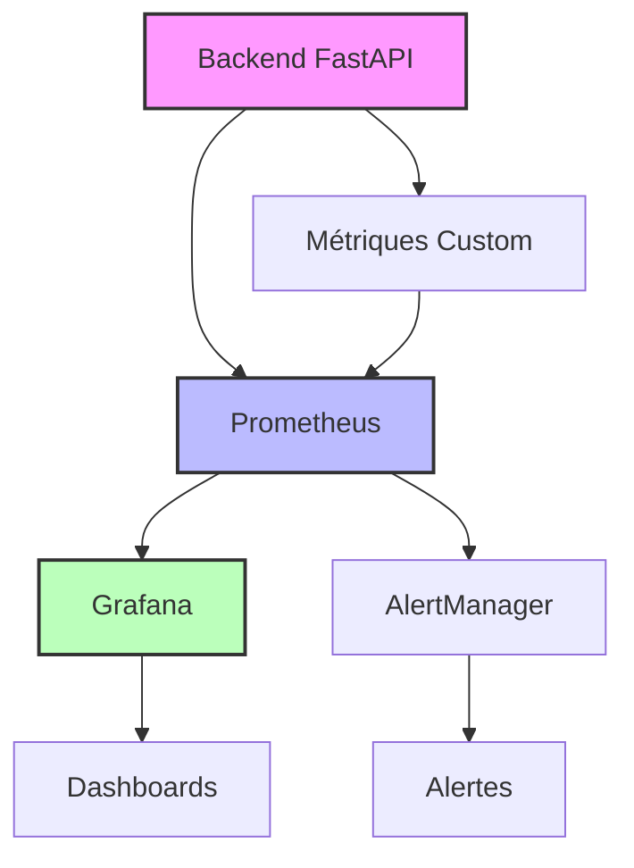

# 📊 **Guide de Monitoring - Elasticsearch Analyzer App**

## 📋 **Table des Matières**
- [📖 Vue d'ensemble](#-vue-densemble)
- [🎯 Architecture de Monitoring](#-architecture-de-monitoring)
- [🔧 Configuration Prometheus](#-configuration-prometheus)
- [📈 Métriques Principales](#-métriques-principales)
- [🚨 Règles d'Alerte](#-règles-dalerte)
- [📊 Dashboards Grafana](#-dashboards-grafana)
- [🔍 Dépannage](#-dépannage)
- [📚 Ressources](#-ressources)

---

## 📖 **Vue d'ensemble**

Ce guide couvre la configuration et l'utilisation du monitoring complet de l'application avec Prometheus, Grafana et les métriques personnalisées.

### **🎯 Objectifs du Monitoring**
- **Observabilité** : Visibilité complète sur le système
- **Performance** : Détection des goulots d'étranglement
- **Fiabilité** : Alertes proactives sur les problèmes
- **Business** : Métriques d'utilisation et de qualité

---

## 🎯 **Architecture de Monitoring**



### **🔗 Composants du Monitoring**
- **Backend FastAPI** : Génération des métriques
- **Prometheus** : Collecte et stockage des métriques
- **Grafana** : Visualisation et dashboards
- **AlertManager** : Gestion des alertes

---

## 🔧 **Configuration Prometheus**

### **📁 Fichier de Configuration Principal**
```yaml
# prometheus.yml
global:
  scrape_interval: 15s
  evaluation_interval: 15s

rule_files:
  - "rules/*.yml"

scrape_configs:
  - job_name: 'elasticsearch-analyzer'
    static_configs:
      - targets: ['localhost:8000']
    metrics_path: '/metrics'
    scrape_interval: 10s
    scrape_timeout: 5s
```

### **📊 Métriques Collectées**
| Catégorie | Description | Fréquence |
|-----------|-------------|-----------|
| **Performance** | Latence des opérations, taux de succès | 10s |
| **Business** | Utilisation des fonctionnalités, erreurs | 15s |
| **Système** | Ressources, base de données, Elasticsearch | 30s |

---

## 📈 **Métriques Principales**

### **🔧 Mapping DSL V2.2**
```prometheus
# Compilation des mappings
mapping_compile_calls_total{version="v2.2"}
mapping_compile_duration_seconds{version="v2.2"}

# Application des mappings
mapping_apply_success_total{version="v2.2"}
mapping_apply_fail_total{version="v2.2"}

# Opérations array
mapping_array_operations_total{operation="filter"}
mapping_array_operations_total{operation="slice"}
mapping_array_operations_total{operation="unique"}
mapping_array_operations_total{operation="sort"}
```

### **🔧 Mapping DSL V2.1**
```prometheus
# Opérations de base
mapping_zip_pad_events_total
mapping_objectify_records_total
mapping_op_ms_count{operation="zip"}

# Cache JSONPath
jsonpath_cache_hits_total
jsonpath_cache_misses_total
jsonpath_cache_size
```

### **⚡ Performance et Erreurs**
```prometheus
# Latence
http_request_duration_seconds{endpoint="/mappings/validate"}
http_request_duration_seconds{endpoint="/mappings/compile"}

# Erreurs
http_requests_total{status="500"}
http_requests_total{status="400"}

# Disponibilité
up{job="elasticsearch-analyzer"}
```

---

## 🚨 **Règles d'Alerte**

### **🔴 Alertes Critiques**
```yaml
# prometheus_rules.yml
groups:
  - name: elasticsearch-analyzer-critical
    rules:
      - alert: HighErrorRate
        expr: rate(http_requests_total{status="500"}[5m]) > 0.05
        for: 2m
        labels:
          severity: critical
        annotations:
          summary: "Taux d'erreur élevé"
          description: "Plus de 5% d'erreurs sur 5 minutes"
      
      - alert: MappingCompileFailure
        expr: rate(mapping_compile_fail_total[5m]) > 0
        for: 1m
        labels:
          severity: critical
        annotations:
          summary: "Échec de compilation des mappings"
          description: "Impossible de compiler les mappings"
```

### **🟡 Alertes Warnings**
```yaml
      - alert: HighLatency
        expr: histogram_quantile(0.95, http_request_duration_seconds) > 0.1
        for: 5m
        labels:
          severity: warning
        annotations:
          summary: "Latence élevée P95"
          description: "Latence P95 supérieure à 100ms"
      
      - alert: LowJsonPathCache
        expr: jsonpath_cache_hits_total / (jsonpath_cache_hits_total + jsonpath_cache_misses_total) < 0.7
        for: 10m
        labels:
          severity: warning
        annotations:
          summary: "Cache JSONPath faible"
          description: "Taux de cache inférieur à 70%"
```

### **🟢 Alertes Info**
```yaml
      - alert: NewMappingCreated
        expr: increase(mapping_compile_calls_total[1h]) > 0
        for: 0m
        labels:
          severity: info
        annotations:
          summary: "Nouveau mapping créé"
          description: "Un nouveau mapping a été compilé"
```

---

## 📊 **Dashboards Grafana**

### **🎯 Dashboard Principal**
- **URL** : http://localhost:3000/d/elasticsearch-analyzer
- **Objectif** : Vue d'ensemble du système
- **Panneaux** : Métriques clés, alertes actives, statut des services

### **📈 Dashboard Performance**
- **URL** : http://localhost:3000/d/performance
- **Objectif** : Analyse des performances
- **Panneaux** : Latence, débit, utilisation des ressources

### **🔍 Dashboard Business**
- **URL** : http://localhost:3000/d/business
- **Objectif** : Métriques métier
- **Panneaux** : Utilisation des fonctionnalités, qualité des données

---

## 🔍 **Dépannage**

### **🚨 Problèmes Courants**

#### **1. Métriques Non Collectées**
```bash
# Vérifier la connectivité
curl http://localhost:8000/metrics

# Vérifier la configuration Prometheus
promtool check prometheus.yml

# Vérifier les logs
docker logs prometheus
```

#### **2. Alertes Non Déclenchées**
```bash
# Vérifier les règles
curl http://localhost:9090/api/v1/rules

# Vérifier les alertes actives
curl http://localhost:9090/api/v1/alerts

# Vérifier AlertManager
curl http://localhost:9093/api/v1/alerts
```

#### **3. Dashboards Vides**
```bash
# Vérifier la source de données
curl http://localhost:3000/api/datasources

# Vérifier les permissions
curl http://localhost:3000/api/user
```

### **🔧 Commandes de Diagnostic**
```bash
# Statut des services
docker-compose ps

# Logs en temps réel
docker-compose logs -f prometheus
docker-compose logs -f grafana

# Test de connectivité
nc -zv localhost 9090  # Prometheus
nc -zv localhost 3000  # Grafana
```

---

## 📚 **Ressources**

### **🔗 Documentation Externe**
- [Prometheus](https://prometheus.io/docs/) - Documentation officielle
- [Grafana](https://grafana.com/docs/) - Guides et tutoriels
- [AlertManager](https://prometheus.io/docs/alerting/latest/alertmanager/) - Gestion des alertes

### **📋 Templates et Exemples**
- **Dashboard JSON** : `monitoring/grafana_dashboard_v21.json`
- **Règles Prometheus** : `monitoring/rules/mapping-studio-rules.yml`
- **Configuration** : `monitoring/prometheus.yml`

### **🧪 Tests et Validation**
```bash
# Tester les métriques
curl http://localhost:8000/metrics | grep mapping

# Valider la configuration
promtool check prometheus.yml

# Tester les alertes
curl -X POST http://localhost:9093/api/v1/alerts
```

---

## 📊 **Métriques de Monitoring**

### **📈 Indicateurs Clés de Performance (KPIs)**
| Métrique | Objectif | Seuil Critique |
|----------|----------|----------------|
| **Disponibilité** | > 99.9% | < 99% |
| **Latence P95** | < 100ms | > 500ms |
| **Taux d'erreur** | < 1% | > 5% |
| **Cache hit rate** | > 80% | < 50% |

### **🔄 Fréquence de Collecte**
- **Métriques système** : Toutes les 30 secondes
- **Métriques applicatives** : Toutes les 10 secondes
- **Métriques business** : Toutes les minutes
- **Alertes** : Évaluation toutes les 15 secondes

---

**Version** : 2.2.1  
**Dernière mise à jour** : Décembre 2024  
**Statut** : ✅ Production Ready  
**Monitoring** : ✅ **Configuré et Opérationnel**
